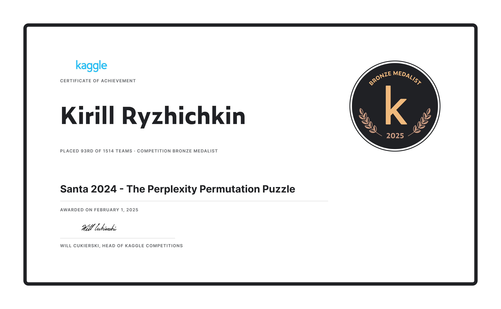

# Santa 2024 - The Perplexity Permutation Puzzle (Kaggle Bronze Medal)
 
## Description

> Use your coding magic and linguistic skills to rearrange the words, making the stories flow smoothly and beautifully once more. The Kagglers who achieve the lowest perplexity scores will win Rudolph's heart and earn a place on the leaderboard! So join Rudolph and his friends in this festive challenge! Untangle the words, spread Christmas cheer, and help make this a holiday to remember!

## Solution

- Simulated Annealing (1st stage)
  - [code](scripts/default-optimizer.py)
- Alphabetical SA for last sample (2nd stage)
  - [code](scripts/optimize-last-sample.py)
- Bruteforce after SA (3rd stage)
  - [code](scripts/brute.py)

## Certificate

